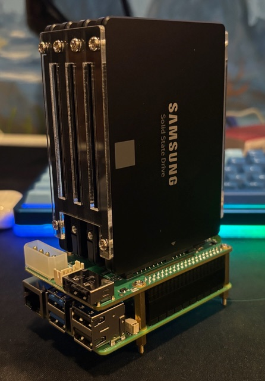
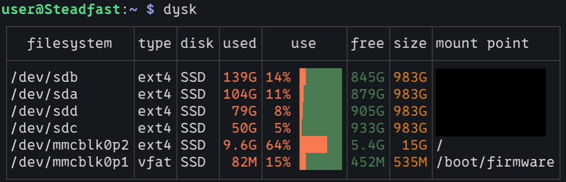
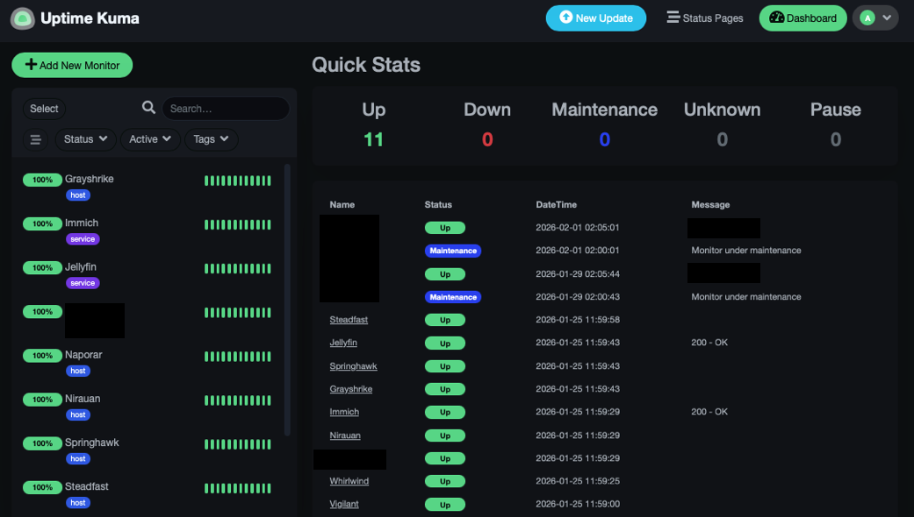
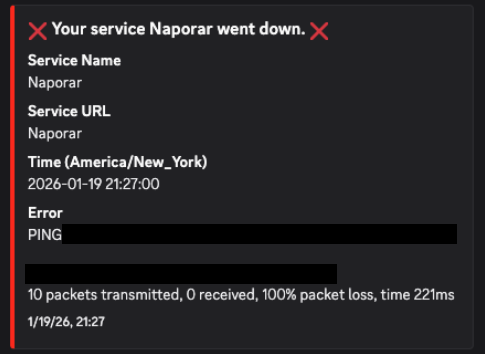
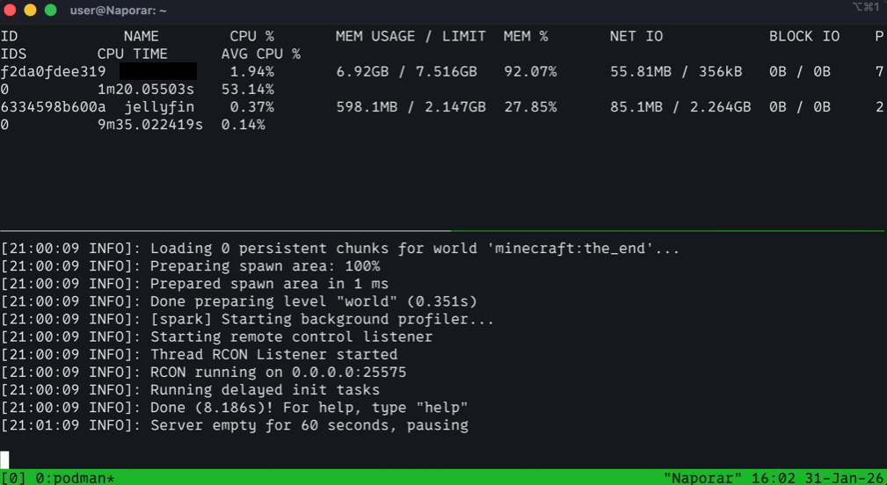
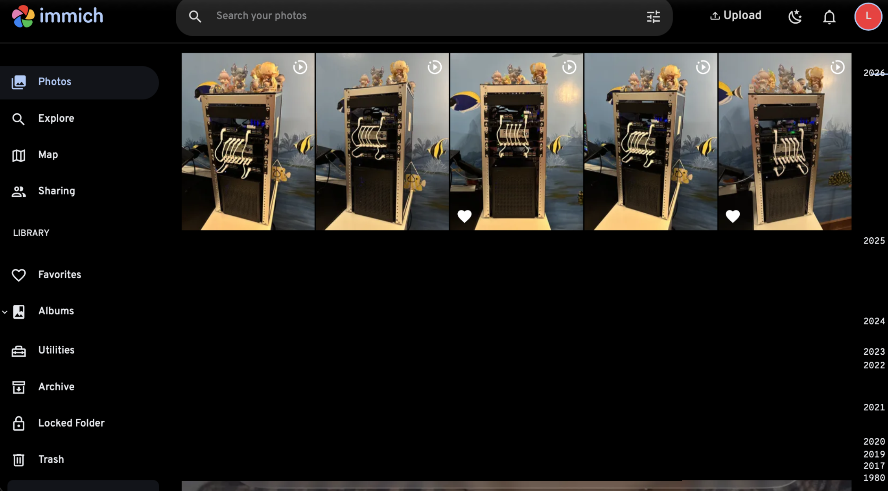
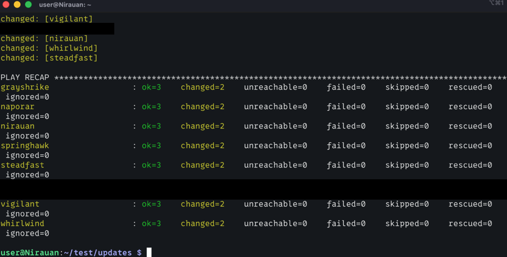

# Ascendancy 2.0 Homelab Write-up
Ascendancy, as in the Star Wars Chiss Ascendancy, is the name of my homelab. This repository is the second and more complete write-up following comprehensive changes in my environment.

## Overview


\
\
Each host description will focus on a different software or service, but many hosts share or utilize the same services.

## Hosts

### Steadfast (NAS + Pi-hole)
*Raspberry Pi 5: 8GB, 4 x 1 TB Samsung SSD* \
*Steadfast - Chiss heavy cruiser*




Based on [Jeff Geerling's Pi 5 NAS build](https://www.youtube.com/watch?v=l30sADfDiM8), I put together a NAS with a very small footprint. This machine is used for backups and my Jellyfin library.

The SSDs used in this device are not redundant. There is no RAID hardware controller, and I do not use the ZFS filesystem. This was not an easy decision to make, but the contributing factors are as follows:
1. This NAS is not the only place my backups live. I keep multiple backups of critical data on different devices, and some in different locations. If I unplugged this Pi right now and threw it in the trash, I wouldn't lose data that couldn't be replaced.
    - Because this is not my sole backup method, I choose capactity over redundancy. With all four disks I have 4TB of storage, while in RAIDZ-1 (RAID 5 but in ZFS), I would only have ~2.5TB.
    - Using LVM or ZFS would shift the single point of failure to the Pi's micro SD card, on which the OS is installed. In theory, it should be possible to recover the ZFS filesystem or an LVM with a new installation of the OS, but this added complexity increases the chance I'll break it during recovery. Testing this situation seems overly complex.
    - ZFS, with its self-heals and copy-on-write *may* signifigantly decrease the lifespan of the SSDs. I don't have first hand experience with this, and it depends what sources you read, but this was a big concern for me.
    - I think human error is far more likely to break this machine than a hardware failure.
2. I do not consider my Jellyfin library critical data. While it's true that replacing the library would take time, I still have all the DVDs, and can rip them again.
3. Data that would be inconvenient for me to lose from a single SSD hardware failure is copied to a second SSD.

The NAS is accessible to myself, specific service accounts, and my family. Each drive has its own SMB share, since the drives are not linked. For example, here are the SMB rules for one of the drives:
```
[share_name]
        path = /mnt/[ssd_name]
        valid users = immich
        read only = no
        browseable = yes
        hide unreadable = yes
```
For this to work, there must exist a `immich` user who owns a directory in this share. There is, as there is a `jellyfin` user who owns the directory where Jellyfin media is stored.

Steadfast also hosts Pi-hole, a very popular ad-blocking DNS server. For now, I have manually changed the DNS server on some of my devices to Pi-hole's. After more testing, I may change my router's DHCP to point to Pi-hole for DNS.

### Whirlwind (Uptime Kuma)
*Raspberry Pi 3 Model B* \
*Whirlwind - CEDF starship hosting the Vagaari gravity well projector*


Once a minute, Uptime Kuma attempts to ping each host, or tries to connect to a specific URL in the case of Immich and Jellyfin, or parses the response from the Minecraft server, to determine what is online. If it does not get a response, a webhook is called which sends me a message on Discord, identifying which service is down.



Maintenance can also be scheduled, to pause the "pinging" of each host and service. I manually schedule this every time I kick off updates and restart the hosts, but I have also scheduled it for each time the Minecraft server stops to create a backup.

### Springhawk (Proxmox)
*HP Z2 Mini G4* \
*Springhawk - Chiss heavy cruiser*


An operating system based on Debian, Proxmox is the hypervisor I use for virtual machines. My VPN, Jellyfin instance, and Minecraft server are split among virtual machines on this host. Springhawk is simply the Proxmox node.

### Naporar (Podman: Jellyfin & Minecraft)
*VM* \
*Naporar - Home planet of the Chiss Expansionary Defense Fleet (CEDF)*



Podman is my tool of choice for hosting Jellyfin and a Minecraft server. In constrast with Docker, Podman is rootless by default. It creates a user with a new namespace for running containers. Updating containers is easy, achieved by re-creating the container using the same command or compose file. Backing up data from containers is similarly straightforward. Ephemeral data can be ignored. Important data that must persist between containers can be saved by mounting internal Podman directories to a location on the host.

For example, when starting my Minecraft server, the folowing flag is included: \
```-v /home/user/[directory_for_data]:/data:Z```

Different containers may require different arguments or syntax, but by mounting Podman's data in a location accesible to the user, the data can be viewed, edited, or backed up using standard command line tools. While this data may be initially visible to the user, it may be owned by the user and group that Podman created. The `unshare` flag must be used for Podman commands where the user does not own the file. 

For example, the following command is used in the Minecraft server's backup script: \
```podman unshare zip -r "/home/user/backups/${CURRENT_DATE}-[server-name].zip" "/home/user/[server-name]"```

The data resides in `user`'s home directory, but without `sudo` permissions, the `unshare` flag must be used to access data owned by another user.

### Grayshrike (Wireguard VPN + WGDashboard)
*VM* \
*Grayshrike - Chiss heavy cruiser*


Utilizing [Proxmox VE Helper-Scripts](https://community-scripts.github.io/ProxmoxVE/), my Wireguard VPN and web interface (WGDashboard) run on Grayshrike. I mainly use it to work on the homelab or access Jellyfin remotely. Thankfully, my ISP has assigned my home a static IP...for now.


### Vigilant (Immich)
*Raspberry Pi 5: 8GB* \
*Vigilant - Chiss Nightdragon man-of-war*



Immich is a photo backup application, visually very similar to Google Photos. The compute for this application lives on  Vigilant, while the actual photo/video storage is on Steadfast. Immich has a web interface and an app that it can connect to. It also uses small local machine learning models to categorize faces in your photo library, and detects text in images. I strongly recommend turning this off until all photos have been uploaded so there isn't a strain on resources.

For those using Immich for the first time, I suggest uploading media by storing it on the host first, or uploading it through the web interface. The developers are doing an overhaul of the mobile application, but my understanding is that first-time uploads need to be compared to all images and videos to prevent duplicates. All photos must also be downloaded locally on the mobile device, which I don't think is the default on iOS.

### Nirauan (Ansible)
*Raspberry Pi 3 Model B* \
*Nirauan - Planet of the Hand of Thrawn*



This Pi is used soley to store and run Ansible playbooks. My orginal intention was to write a playbook to check that all hosts were online and email myself status reports, but Uptime Kuma solved that problem. Right now, this host is only used to update all machines using the following script:
```
- name: Fully upgrade system packages
  hosts: all

  vars_files:
    - vault.yml

  tasks:
    - name: Update apt package index
      apt:
        update_cache: yes
    - name: Upgrade apt packages
      apt:
        upgrade: dist
```
All my hosts use `apt`, making the script relatively simple On all hosts exists an `ansible-runner` user. This playbook must be kicked off manually, as it requires the vault password from `vault.yml`, which stores the `sudo` passwords for these users. 

### Boco (SSH Key Management)
*MacBook Pro M2 Pro* \
*Boco - Chiss patrol ship*

While not *technically* a part of my homelab, my laptop is used to SSH into all devices. All hosts have SSH password authentication disabled. In order to connect to any machine, the remote host must have the public key saved in it's `~/.ssh/authorized_keys` file. Then, when using a private key on the local host, the key must first be unencrypted.

One key pair is generated for each "tunnel" from host to host. For example, Boco has a different keypair to connect to Steadfast than Naporar does to Steadfast. Therefore:
1. Brute force attacks on the SSH service are impossible, as password authentication is disabled.
2. Any keypair can be revoked without interrupting remote access to other hosts.
3. Each private key is password protected, further preventing their misuse.

## Other Notable Software and Services
### Cron Backups
Jellyfin and Immich store configuration data that would be inconvenient to lose. The Minecraft server too needs to be backed up in its entirely, not just the `/world` folder. For each service, there is a `bash` script that is called on a schedule using `cron`.

For example, this is the script to backup the Minecraft server:
```bash
#!/bin/bash

# get date
CURRENT_DATE=$(date +%F)

# stop container
podman stop [container-name]

# zip directory
podman unshare zip -r "/home/user/backups/${CURRENT_DATE}-[container-name].zip" "/home/user/[container-name]"

# start server again
podman start [container-name]
```
It runs automatically with the following line in the `crontab` file:
```
0 2   *   *  0,4   /home/user/scripts/backup-[container-name].sh
```
Shoutout to [crontab guru](https://crontab.guru/#0_2_*_*_0,4) for helping me create this line to call the script at 2:00 on Sunday and Thursday. As mentioned previously, downtime is scheduled in Uptime Kuma for several minutes at this time.

On Steadfast, the "collection" of the backup runs a few minutes later:
```bash
#!/bin/bash

# get date
CURRENT_DATE=$(date +%F)

# get backup
scp -i /home/user/.ssh/[ssh-private-key] user@naporar:/home/user/backups/${CURRENT_DATE}-[container-name].zip ./[backup-path]
```
```
5 2   *   *  0,4   /home/user/scripts/backup-[container-name].sh
```

### Firewalls
All incoming traffic is implicitly denied. Rules are made for specific services that require incoming traffic on the local network. For Proxmox hosts, the built in Proxmox firewall is used. Firewall groups are created at the "datacenter" level, then applied per VM. All other hosts utilize `ufw`.

Because I have physical access to all hosts, I'm not concerned about locking myself out. Better to get locked out of remote access than have the firewalls be too permissive.

### VLANs
This is shown in the diagram at the beginning, but all "Ascendancy" devices exist in one VLAN, and my Windows gaming PC exists in another.

I still don't trust Microsoft.

## Improvements Over [Ascendancy 1.0](https://github.com/read-e/Ascendancy-Homelab)
- Network Attached Storage (NAS)
    - Dramatically increases storage space and improves data redeundancy using proper backups.
- Reliability
    - Implementation of uptime monitoring.
    - Raspberry Pis mounted with dedicated shelves rather than laptop motherboards out of their chassis.
- Resource utilization
    - Pis that draw a very low amount of power but have plenty of compute for their tasks.
    - Fewer machines, with some hosting multiple services, reducing management overhead.
    - Less resource overhead effecting other VMs in Proxmox, since there are fewer VMs.
- Automatic backups
    - Bash scripts and cron jobs further reduce management overhead.
- More documentation
    - When setting up this environment, all commands run were saved and labelled appropriately, to make disaster recovery and troubleshooting simpler.

\
Thank you for reading.
